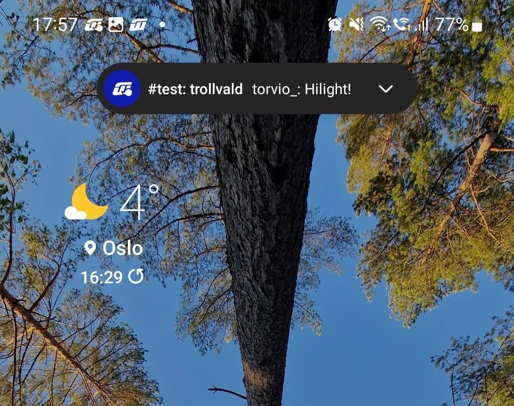

# irc-on-fly

[Fly.io](https://fly.io) has a [free
tier](https://fly.io/docs/about/pricing/) for up to 3
`shared-cpu-1x 256mb` and 3GB of persistant storage! Lets
leverage that for an uncompromising IRC client setup.

This project gives you a `weechat` instance, sprinkled with relay config, and
SSH daemon and [Glowing Bear](https://glowing-bear.org/) on top. It also comes
with a maintenance free TLS setup, because fly.io's ingress layer «just works».


## Screenshots

### Desktop

Glowing Bear in the browser | WeeChat over SSH
:-------------------------:|:-------------------------:|
 |   

### Mobile
Glowing Bear   |  Weechat Android app | with notifications!
:-------------:|:-----:|:--------:
 |   | 

## Setup

Create yourself a [fly.io](https://fly.io/app/sign-up) account.

Then pull the repo and;

```
# Install flyctl
curl -L https://fly.io/install.sh | sh

# Add your public key so you can ssh to the box
mkdir keys
cp <your-pub-key> keys/id.pub

# Change the relay password
sed -i 's/ChangeThis/<new-password>/' config/relay.conf

# Add your own project name to it (becoms your hostname <name>.fly.dev`)
sed 's/irc-on-fly/<your-project-name>/' fly.toml

# Add a persistant volume, choose a nearby region
fly volumes create weechat --size 1

# Deploy!
fly deploy
```

## Usage

[Glowing Bear](https://glowing-bear.org/) is a static HTML page with no
backend, everything happens in your browser. Fill inn you hostname
(`<name>.fly.dev`) and password and voila.

    https://<name>.fly.dev/

or this

    ssh -p 2222 irc-on-fly.fly.dev -t 'screen -rd'

or download the [Weechat Android
app](https://play.google.com/store/apps/details?id=com.ubergeek42.WeechatAndroid.dev&hl=en_US&gl=US).

## Debugging

`fly ssh console` immediately gives you a root shell. Supervisord logs to files
in `/app/`.

## Tips and party tricks

### Use tmux instead of screen (untested)

If tmux is your prefered choice; install it in the Dockerfile. and
alter the command in supervisord.conf with

    command=/usr/bin/tmux -L weechat new -d -s weechat weechat

### Persist config

This setup hold WeeChat config files in the folder
`repo:config/weechat/` for ease of bootstrap and
reproduceability. Because WeeChat really like to have all
changes done via the command line here are a couple of steps for
fetching your running config file down to your local repo.

In weechat

 - `/autojoin --run` to store the channels to join
 - `/layout store` to store the order of the channels
 - `/save` to save your settings to a disk

Get the files and have your repo be the source of truth on next deploy.

```
FILES="irc plugins relay weechat"
for file in $FILES; do scp -P 2222 -i <key> "weechat@<name>.fly.dev:.weechat/${file}.conf" config/weechat/; done
```

### Add plugins

Add to Dockerfile, just besides the `autojoin.py`.
