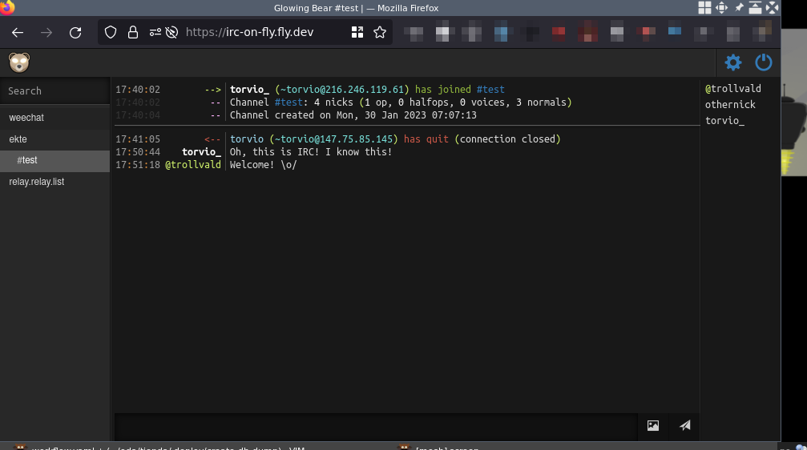

# irc-on-fly

[Fly.io](https://fly.io) has a [free tier](https://fly.io/docs/about/pricing/)
for up to 3 `shared-cpu-1x 256mb`. Lets leverage that for an uncompromising IRC
client setup.

This project gives you a `weechat` instance, bundled with relay config and
[Glowing Bear](https://glowing-bear.org/) on top. It also comes with a
maintenance free TLS setup, because fly.io ingress layer «just works».

## Screenshots

### Desktop

Glowing Bear               |  WeeChat over SSH
:-------------------------:|:-------------------------:|
 |   

### Mobile
Glowing Bear   |  Weechat Android app | with notifications!
:-------------:|:-----:|:--------:
 |   | 

## Setup

Create yourself a [fly.io](https://fly.io/app/sign-up) account.


Then pull the repo and;

```
# Install flyctl
curl -L https://fly.io/install.sh | sh

# Add your public key so you can ssh to the box
mkdir keys
cp <your-pub-key> keys/id.pub

# Change the relay password in 
sed -i 's/ChangeThis/<new-password>/' config/relay.conf

# Change the username if you want
sed 's/user=weechat/user=<username>/' Dockerfile

# Add your own project name to it (becoms your hostname <name>.fly.dev`)
sed 's/irc-on-fly/<your-project-name>/' fly.toml

# Deploy!
flyctl deploy
```

## Usage

[Glowing Bear](https://glowing-bear.org/) is a static HTML page with no
backend, everything happens in your browser. Fill inn you hostname
(`<name>.fly.dev`) and password and voila.

    https://<name>.fly.dev/

or this

    ssh -p 2222 irc-on-fly.fly.dev -t 'screen -rd'

or download the [Weechat Android
app](https://play.google.com/store/apps/details?id=com.ubergeek42.WeechatAndroid.dev&hl=en_US&gl=US).

## Debugging

`flyctl ssh console` immediately gives you a root shell. Supervisord logs to files in `/app/`.

## Tips and party tricks

### Use tmux instead of screen

If tmux is your prefered choice; install it in the Dockerfile. and
alter the command in supervisord.conf with

    command=/usr/bin/tmux -L weechat new -d -s weechat weechat

### Persists your logs

If you want to persists your logs, you can add a persistent volume. At the
moment the free tier gives you 3GB worth of data, plenty for your IRC logs.

    fly volumes create weechat-logs --size 1

and add to your `fly.toml`

```
[mounts]
source="weechat-logs"
destination="/home/weechat/.weechat/logs"
```

and redeploy with `flyctl deploy`.
